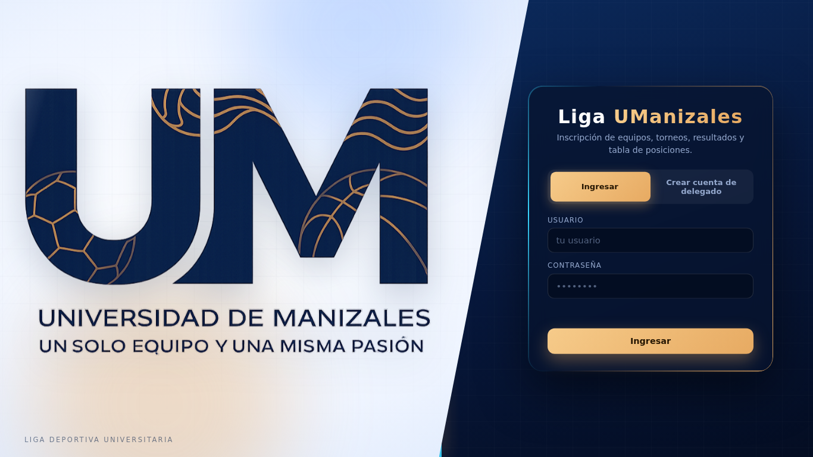
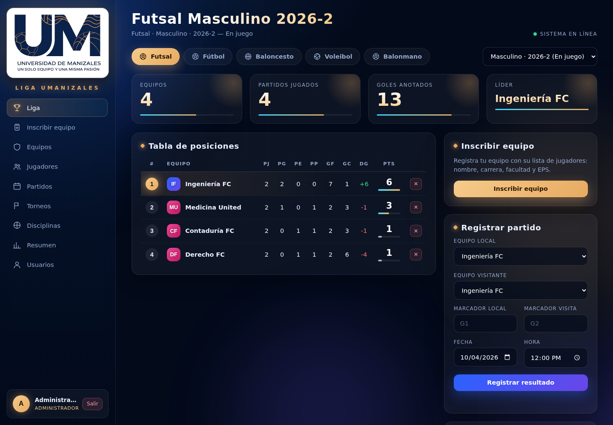
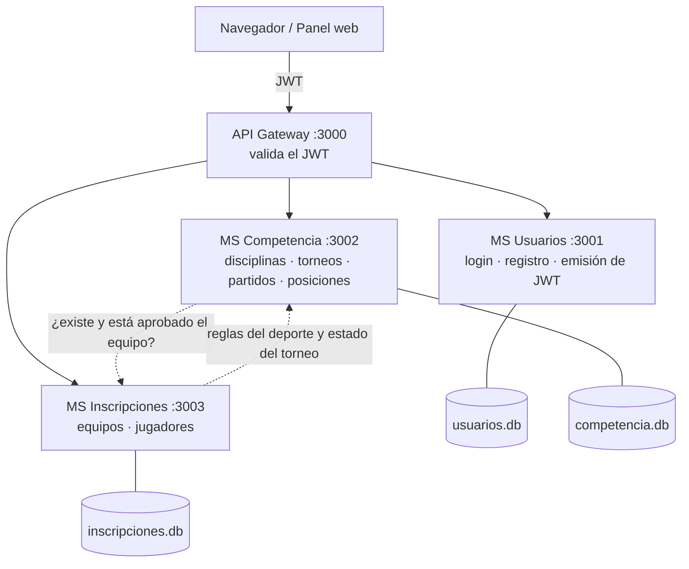
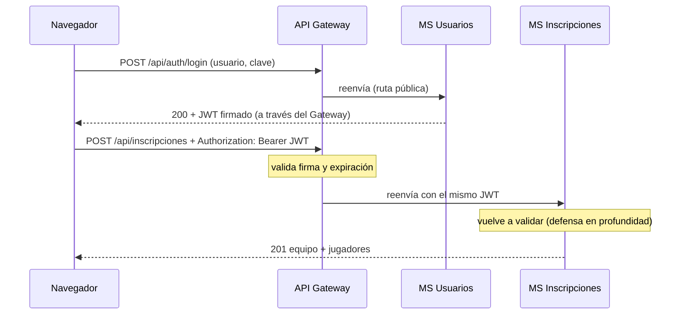

# Liga UManizales — Liga Deportiva Universitaria

> Proyecto Etapa 2 · Módulo **DevOps – WebApps** · Universidad de Manizales
> Sistema web para organizar la liga deportiva de la universidad: **inscripción de equipos y jugadores, torneos, partidos y tabla de posiciones**, con **microservicios en capas, API Gateway y autenticación JWT**.
> La pantalla principal sigue el prototipo `Liga UManizales PRO` entregado como referencia (`docs/referencia_agusto.zip`), con **diseño de escritorio futurista y animado**, en la paleta del logo institucional (azul `#09234a` y dorado `#e7aa62`).

<p align="center"> </p>

---

## 1. Problema

La liga deportiva universitaria (futsal, fútbol, baloncesto, voleibol y otras disciplinas) se organiza hoy con hojas sueltas y chats:

- Los equipos se inscriben sin un formulario único; falta saber **cuántos jugadores** tiene cada equipo y **quiénes son** (nombre, carrera, facultad y **EPS**).
- Un mismo estudiante puede aparecer en dos equipos del mismo torneo y nadie lo detecta.
- Las plantillas no respetan el mínimo y máximo de jugadores de cada deporte.
- La tabla de posiciones se calcula a mano, con reglas distintas por deporte (futsal da 3-1-0, baloncesto no tiene empates, voleibol cuenta sets) y se desactualiza al corregir un resultado.
- Todos pueden modificar todo: no hay permisos.

## 2. Solución propuesta

Una aplicación web con **cuatro piezas independientes** (API Gateway + 3 microservicios), cada una con su propia base de datos:

| Pieza | Puerto | Responsabilidad |
|---|---|---|
| **api-gateway** | 3000 | Única puerta de entrada: sirve el panel web, **valida el JWT** y enruta |
| **ms-usuarios** | 3001 | Registro de delegados, login y emisión del **JWT**, gestión de usuarios |
| **ms-competencia** | 3002 | Disciplinas (reglas por deporte), torneos, partidos y **tabla de posiciones** |
| **ms-inscripciones** | 3003 | **Formulario de inscripción**: equipos y jugadores (nombre, carrera, facultad, EPS) |

**Flujo de una temporada:**
1. El administrador crea un **torneo** (disciplina + rama + periodo, p. ej. *Futsal Masculino 2026-2*) con las inscripciones abiertas.
2. Cada **delegado** crea su cuenta, entra y llena el **formulario de inscripción**: datos del equipo y la lista de jugadores. El equipo queda *Pendiente*.
3. El administrador **aprueba** (o rechaza) cada equipo. Aprobar exige el **mínimo de jugadores** del deporte.
4. El administrador pone el torneo **En juego**, programa y **registra los resultados**. La **tabla de posiciones** se recalcula sola.

**Roles y permisos** (solo el administrador edita y elimina):

| Acción | Administrador | Delegado de equipo |
|---|:---:|:---:|
| Ver torneos, partidos y tabla de posiciones | ✅ | ✅ |
| Inscribir su equipo con sus jugadores (mientras el torneo tenga inscripciones abiertas) | ✅ | ✅ |
| Agregar jugadores a **su** equipo | ✅ | ✅ |
| Ver jugadores (documento, EPS) | de todos | **solo de sus equipos** |
| Aprobar / rechazar / editar / eliminar equipos y jugadores | ✅ | ❌ |
| Crear y editar torneos y disciplinas | ✅ | ❌ |
| Programar partidos y registrar resultados | ✅ | ❌ |
| Gestionar usuarios | ✅ | ❌ |

## 3. Integrantes

| Integrante | Microservicio a cargo |
|---|---|
| **LEO MONTES** | `api-gateway` + `ms-usuarios` (autenticación y JWT) |
| _[Nombre 2]_ | `ms-competencia` (disciplinas, torneos, partidos, posiciones) |
| _[Nombre 3]_ | `ms-inscripciones` (equipos y jugadores) |

> Completar con los nombres reales del grupo (máximo 3 personas).

## 4. Tecnologías utilizadas

- **Node.js 18+** y **Express 4**
- **Axios** (Gateway → microservicios y comunicación entre microservicios)
- **JWT** (`jsonwebtoken`, HS256) y **bcryptjs** (hash de contraseñas)
- **SQLite** (`better-sqlite3`): una base de datos por microservicio
- **npm workspaces** + **concurrently** (un solo `npm install` y un solo `npm start`)
- **Git / GitHub** (una rama por integrante, unión en `main`)
- Front-end: HTML + CSS + JavaScript puro, servido por el Gateway

## 5. Arquitectura



- **Base de datos por servicio:** ningún servicio lee la base de otro; lo que necesita, lo pide por HTTP (Axios) reenviando el JWT del usuario.
- **El Gateway valida el JWT y cada microservicio lo vuelve a validar** (defensa en profundidad): llamar directo al puerto 3002 o 3003 sin token también da 401.
- **La tabla de posiciones no se guarda:** se calcula siempre desde los partidos jugados, así nunca queda desactualizada al editar o borrar un resultado.

### 5.1 Capas dentro de cada microservicio

```
Gateway ──► Routes ──► Controller ──► Service ──► Repository ──► Base de datos
            (URL +      (HTTP)      (reglas de     (SQL)          (SQLite)
          seguridad)                  negocio)       Models: describen las tablas
```

| Capa | Responsabilidad | Lo que **NO** hace |
|---|---|---|
| **Gateway** | Entrada única, valida JWT, enruta al microservicio correcto | Reglas de negocio |
| **Routes** | Une URL + método con un controller; aplica `requireAuth` / `requireRole` | Lógica |
| **Controller** | Lee la petición HTTP, llama al service, responde código y JSON | SQL o reglas de negocio |
| **Service** | Reglas: plantilla mín./máx., un estudiante por torneo, aprobación, choques de horario, validación de marcador | Conocer `req`/`res` ni SQL |
| **Repository** | Único lugar con SQL | Reglas de negocio |
| **Model** | Define tablas, campos y esquema | Lógica |

### 5.2 Reglas de cada deporte (`ms-competencia/src/utils/reglas.js`)

| Disciplina | Marcador | Puntos de tabla | Plantilla (mín. – máx.) |
|---|---|---|---|
| Futsal | goles | victoria 3 · empate 1 · derrota 0 | 5 – 12 |
| Fútbol | goles | victoria 3 · empate 1 · derrota 0 | 11 – 22 |
| Baloncesto | puntos (**sin empates**) | victoria 2 · derrota 1 | 5 – 12 |
| Voleibol | sets (3-0, 3-1 o 3-2) | 3-0 y 3-1: 3 al ganador · 3-2: 2 al ganador y 1 al perdedor | 6 – 12 |
| Balonmano | goles | victoria 3 · empate 1 · derrota 0 | 7 – 14 |

El administrador puede **editar o agregar disciplinas** desde el panel.

### 5.3 Estructura del proyecto

```
liga-universitaria/
├── api-gateway/                 → puerto 3000
│   ├── public/                  → panel web (login con logo, liga, inscripción, gestión)
│   └── src/  app.js · config/ · middleware/ · routes/ · controllers/ · services/
├── ms-usuarios/                 → puerto 3001
├── ms-competencia/              → puerto 3002
├── ms-inscripciones/            → puerto 3003
│   └── (cada uno)  src/  app.js · config/ · models/ · repositories/ · services/
│                         controllers/ · routes/ · middleware/ · utils/ · clients/
├── scripts/                     → probar-jwt · datos-demo · reset-usuarios
├── docs/                        → guía de sustentación, capturas y archivo de referencia
├── package.json                 → workspaces + scripts de arranque
└── .env.example                 → configuración (copiar a .env)
```

Cada microservicio sigue la estructura pedida por el profesor (`controllers/`, `services/`, `repositories/`, `routes/`, `models/`, `app.js`, `package.json`, `README.md`) más `config/`, `middleware/`, `utils/` y `clients/`. Justificación: `config/` centraliza variables de entorno y conexión a la BD; `middleware/` contiene la seguridad JWT; `utils/` los errores y reglas puras; `clients/` aísla las llamadas HTTP a otros servicios.

## 6. Instalación y ejecución

Requisito: [Node.js](https://nodejs.org) 18 o superior.

```bash
cd liga-universitaria
copy .env.example .env      # en Mac/Linux: cp .env.example .env
npm install                 # instala TODO (gateway y los 3 microservicios)
npm run demo:datos          # (opcional) datos ficticios: 3 torneos, 10 equipos, partidos
npm start                   # levanta los 4 procesos a la vez
```

Abre **http://localhost:3000** (el puerto es el del Gateway; los demás son internos).

| Rol | Usuario | Contraseña |
|---|---|---|
| Administrador | `leomontes` | `LeoMontes77-Admin` |
| Delegado de ejemplo | `delegado` | `LeoMontes77-Delegado` |

> Son claves de ejemplo del `.env.example`: cámbialas antes de publicar el sistema. Los delegados reales crean su cuenta desde la pestaña **"Crear cuenta de delegado"** del login (siempre se crean como delegado, nunca como administrador). Si ya tenías la base de usuarios creada, `npm run usuarios:reset` (con los servicios detenidos) aplica las credenciales del `.env`.

El `.env` no viaja en el zip ni en GitHub: hay que crearlo una vez en cada carpeta nueva.

> Las fuentes (Inter y Rajdhani) se cargan desde Google Fonts; sin internet el panel usa las fuentes del sistema y funciona igual.

## 7. API (todas las rutas pasan por el Gateway, `http://localhost:3000`)

| Método | Ruta | ¿JWT? | Rol | Destino |
|---|---|:---:|---|---|
| POST | `/api/auth/login` | ❌ público | — | ms-usuarios |
| POST | `/api/auth/registro` (crea un delegado) | ❌ público | — | ms-usuarios |
| GET | `/api/auth/me` | ✅ | cualquiera | ms-usuarios |
| GET / POST / PUT / DELETE | `/api/usuarios`, `/api/usuarios/:id` | ✅ | admin | ms-usuarios |
| GET | `/api/dashboard` | ✅ | cualquiera | Gateway → ms-competencia + ms-inscripciones |
| GET | `/api/disciplinas`, `/api/torneos`, `/api/torneos/:id` | ✅ | cualquiera | ms-competencia |
| GET | `/api/torneos/:id/posiciones` (tabla, resultados y próximos) | ✅ | cualquiera | ms-competencia (+ ms-inscripciones) |
| POST / PUT / DELETE | `/api/disciplinas`, `/api/torneos` | ✅ | **admin** | ms-competencia |
| GET | `/api/partidos` (`?torneo_id=`) | ✅ | cualquiera | ms-competencia |
| POST / PUT / DELETE | `/api/partidos` | ✅ | **admin** | ms-competencia (valida equipos en ms-inscripciones) |
| **POST** | **`/api/inscripciones`** (equipo + jugadores) | ✅ | cualquiera | ms-inscripciones |
| GET | `/api/equipos` (`?torneo_id=&estado=`) | ✅ | cualquiera (el contacto solo lo ve el admin o su delegado) | ms-inscripciones |
| PUT / DELETE | `/api/equipos/:id` (aprobar, rechazar, editar, eliminar) | ✅ | **admin** | ms-inscripciones (DELETE limpia partidos en ms-competencia) |
| GET | `/api/jugadores` (`?equipo_id=`) | ✅ | admin: todos · delegado: solo los suyos | ms-inscripciones |
| POST | `/api/jugadores` | ✅ | admin o delegado dueño del equipo | ms-inscripciones |
| PUT / DELETE | `/api/jugadores/:id` | ✅ | **admin** | ms-inscripciones |

**Reglas de la inscripción** (`POST /api/inscripciones`):
- El torneo debe existir y estar en *Inscripciones abiertas* (el admin puede saltarse esta regla).
- Hay cupo de equipos y el nombre del equipo no se repite en el torneo.
- Entre 1 y el máximo de jugadores del deporte (el mínimo se exige al **aprobar**).
- Cada jugador: documento, nombres, apellidos, **carrera, facultad y EPS** obligatorios.
- Un estudiante (documento) solo puede estar en **un equipo por torneo**; el dorsal no se repite en el equipo.
- Todo se guarda en **una transacción**: o se inscribe todo el equipo o no se guarda nada.

## 8. JWT, autenticación y autorización

**¿Qué es JWT?** JSON Web Token: una cadena firmada `header.payload.signature` que el servidor entrega al iniciar sesión. El *payload* lleva quién eres y tu rol (`sub`, `username`, `role`, `exp`); la *firma* (HMAC-SHA256 con `JWT_SECRET`) impide alterarlo sin que se note. Así los servicios verifican la identidad **sin consultar la base de datos** en cada petición.



| | **Autenticación** | **Autorización** |
|---|---|---|
| Pregunta | ¿Quién eres? | ¿Qué puedes hacer? |
| En este proyecto | Login (`ms-usuarios`) + `requireAuth` (Gateway y servicios) | `requireRole('admin')` y la regla "el delegado solo ve y modifica lo suyo" |
| Fallo | **401** (sin token, inválido o expirado) | **403** (token válido pero rol insuficiente) |

## 9. Pruebas para la demostración

Con los servicios corriendo:

```bash
npm run probar:jwt
```

Ejecuta **23 pruebas** y muestra el header/payload del token: sin token, token basura, payload alterado, firmado con otro secreto, expirado, contraseña incorrecta, token válido, **acceso directo a cada microservicio saltándose el Gateway**, y las restricciones del delegado (403). Tomar captura para el PowerPoint.

Otras demostraciones en vivo:
- **Expiración real:** en `.env` pon `JWT_EXPIRES_IN=20s`, reinicia, inicia sesión y espera 20 s.
- **Aislamiento de fallos:** levanta cada servicio en su terminal (`npm start -w ms-inscripciones`, etc.) y cierra solo uno: el resto sigue funcionando y el Gateway responde `503` con un mensaje claro.
- **Reglas del deporte:** registrar un 3-3 en voleibol o un empate en baloncesto es rechazado.
- **Log del Gateway:** cada petición muestra a qué microservicio fue enrutada.

## 10. Flujo de trabajo con Git

```bash
git checkout -b feature/ms-competencia   # cada integrante en su propia rama
git add ms-competencia/
git commit -m "feat(competencia): tabla de posiciones por deporte"
git push -u origin feature/ms-competencia
# Pull Request en GitHub -> revisión de un compañero -> merge a main
```

Convención de commits: `feat:`, `fix:`, `docs:`, `refactor:`. **Nunca subir** `.env` ni archivos `.db` (ya están en `.gitignore`).

## 11. Datos personales y limitaciones conocidas

- **Datos personales:** el sistema guarda documento y EPS de estudiantes. En Colombia aplica la Ley 1581 de 2012 (protección de datos personales): se necesita la autorización de cada jugador. Por diseño, un delegado **solo ve a sus propios jugadores**. No uses datos reales en GitHub ni en clases; para la demo usa `npm run demo:datos` (datos ficticios).
- **SQLite por servicio:** ideal para el curso; en producción, PostgreSQL administrado.
- **Secreto JWT compartido (HS256):** en producción, firma asimétrica (RS256) donde solo `ms-usuarios` tenga la clave privada.
- **Borrados entre servicios:** no son una transacción distribuida; si un servicio está caído, la operación se cancela completa (patrón *saga* como mejora).
- **Sin refresh tokens ni revocación:** un token robado vale hasta que expire; si se cambia el rol de un usuario, debe volver a iniciar sesión.
- **El registro de delegados es público** y no tiene límite de intentos (rate limiting) ni verificación de correo.
- **Código de middleware repetido** en cada servicio: es el costo de que cada microservicio sea independiente.
